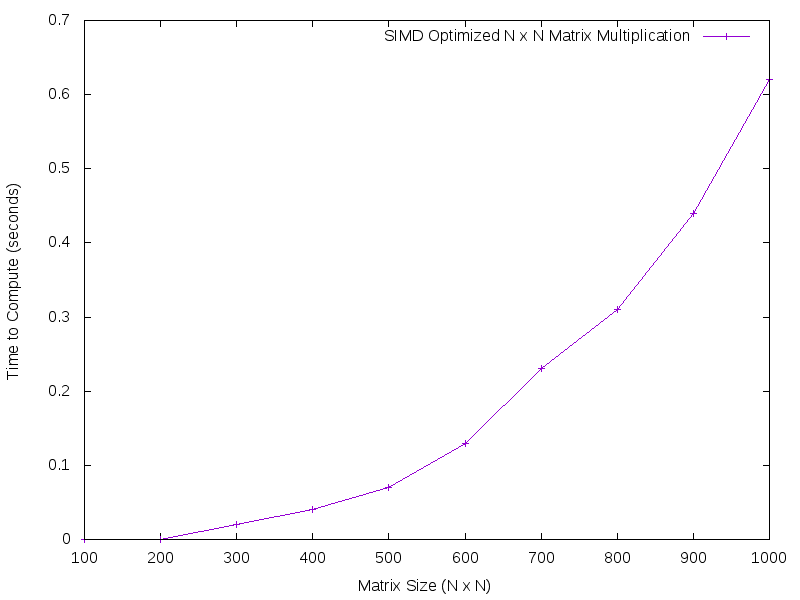

# Matrix Multiplication & Graphing

## Distributed Parallel Computing
The architecture that our group decided to implement was to take each required task (basic, simd, openmp, mpi, etc.) and to make an executable for each one respectively. Each of these executables can then be ran independently, thus allowing an automation pipeline technique to unfold. We automated the running of these independent executable files with a Python 3 script. The final portion of the pipeline consisted of taking the results produced by the automation script, and combining them into graphs of the matrices performances.
 

The algorithms that we implemented are the following:
- A basic matrix multiplication algorithm without SIMD or vector optimization (-O3)
- A SIMD matrix multiplication algorithm with and without the vectorized optimization enabled (with and without the '-O3' argument in the compilation command)
- An OpenMP matrix multiplication algorithm that uses multiple threads to run the matrix multiplcation (includes the '-fopenmp' argument)

## Teamwork
We locked the master branch from all contributions that are not on a separate branch. We reviewed all changes to the branches prior to merging them into the master branch. We also locked project administrators from directly committing to the master branch.

### Steven Nardo
I implemented the function that allows the automated extraction of matrices from a file no matter the size; this gets stored in a vector of doubles to allow for ease of use and reference. In addition, I also implemented the function that then converts the double vector to strings and such prints it to an output file as a way of keeping track of the matrix multiplication product.

### Tanmay Mody
x

### Chris Bilger
I implemented the basic matrix multiplication, SIMD optimized matrix multiplication and OpenMP algorithms. I automated the pipeline of executables and gnuplot using a Python 3 script named 'automation.py'. I also wrote up the README.md file, although we all contributed equally the write up.

## Full Project Life Cycle
We made excellent use of the Trello project board that was setup in the beginning stages of the lab project. The project board made communication and task designation significantly easier and mroe streamlined. The usual code life cycle of 'run, compile, run and test' was the same on the Wolfgang cluster as it would have been on a local machine; however, it was a slower process as we had to interact with the code through the terminal and not in our usual IDEs. The basic testing that we implemented was the final stage PNG files and verifying that each algorithm performed as expected. We did nt have time to implement unit testing, although we would have liked to. In order to generate matrices of varying sizes, we used the second argument (argv[1]) of the executables to generate an N x N matrix; where N is the value of argv[1]. We also included in our plan to automate the project with the aforementioned pipeline approach. This was used to generate the tables and graphs which were then also automated through a GNUPlot script, which generated the PNG files for the graphs. As far as task completion time goes, I would estimate that the majority of time was spend testing algorithms and compiling files / automating files, over actually implementing each algorithm.

## Basic Graph

## SIMD Graph

## OpenMP Graph

## MPI Graph

## Combined Graph

